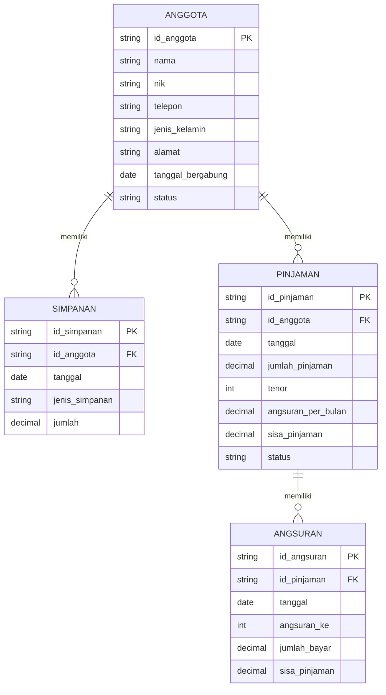

# PERANCANGAN SISTEM KOPERASIKU

## 1. Deskripsi Sistem

KoperasiKu merupakan rancangan sistem informasi administrasi koperasi simpan pinjam berbasis web. Sistem ini dirancang untuk membantu admin koperasi dalam mengelola data anggota, mencatat transaksi simpanan, pinjaman, dan angsuran, serta menyajikan informasi melalui dashboard dan laporan.

Sistem KoperasiKu digunakan sebagai aplikasi administrasi internal koperasi. Anggota tidak melakukan login atau transaksi secara langsung melalui sistem. Proses pencatatan dilakukan oleh admin koperasi berdasarkan transaksi yang dilakukan oleh anggota.

---

## 2. Tujuan Sistem

Sistem KoperasiKu bertujuan untuk membantu admin dalam melakukan pengelolaan data anggota dan pencatatan transaksi koperasi simpan pinjam secara lebih terstruktur.

Tujuan perancangan sistem meliputi:

- Mempermudah pengelolaan data anggota koperasi.
- Mempermudah pencatatan transaksi simpanan.
- Mempermudah pencatatan data pinjaman.
- Mempermudah pencatatan pembayaran angsuran.
- Menampilkan informasi ringkas melalui dashboard.
- Membantu admin dalam membuat dan mencetak laporan transaksi.

---

## 3. Pengguna Sistem

### Admin Koperasi

Admin merupakan pengguna yang melakukan pengelolaan dan pencatatan data dalam sistem.

Admin dapat:

- Login ke sistem.
- Melihat dashboard.
- Mengelola data anggota.
- Menambahkan, melihat, mengubah, dan menghapus data anggota.
- Mencatat transaksi simpanan.
- Mencatat transaksi pinjaman.
- Mencatat pembayaran angsuran.
- Melihat status dan sisa pinjaman.
- Melihat laporan transaksi.
- Mencetak atau mengunduh laporan.

---

## 4. Ruang Lingkup Sistem

Ruang lingkup sistem KoperasiKu meliputi:

- Login Admin.
- Dashboard informasi koperasi.
- Pengelolaan data anggota.
- Pencatatan transaksi simpanan.
- Pencatatan transaksi pinjaman.
- Pencatatan pembayaran angsuran.
- Pemantauan sisa pinjaman.
- Perubahan status pinjaman menjadi Lunas setelah seluruh angsuran dibayarkan.
- Penyajian laporan transaksi.

Sistem tidak mencakup:

- Login anggota.
- Pengajuan pinjaman secara online oleh anggota.
- Pembayaran online.
- Payment gateway.
- Pengelolaan multi-role atau super admin.
- Integrasi WhatsApp.
- Integrasi API eksternal.
- Sistem akuntansi koperasi secara menyeluruh.

---

## 5. Hierarki Menu

```text
KOPERASIKU
│
├── Login Admin
│
├── Dashboard
│   ├── Total Anggota
│   ├── Total Simpanan
│   ├── Total Pinjaman
│   ├── Angsuran Bulan Ini
│   ├── Grafik Simpanan & Pinjaman
│   ├── Status Pinjaman
│   ├── Transaksi Terbaru
│   └── Quick Action
│
├── Anggota
│   ├── Pencarian Anggota
│   ├── Filter Status
│   ├── Tambah Anggota
│   ├── Detail Anggota
│   ├── Edit Anggota
│   ├── Hapus Anggota
│   ├── Pagination
│   └── Empty State
│
├── Form Anggota
│   ├── ID Anggota
│   ├── Nama
│   ├── NIK
│   ├── Nomor Telepon
│   ├── Jenis Kelamin
│   ├── Alamat
│   ├── Tanggal Bergabung
│   ├── Status
│   └── Validasi Form
│
├── Transaksi
│   ├── Semua Transaksi
│   ├── Simpanan
│   ├── Pinjaman
│   ├── Angsuran
│   ├── Pencarian
│   ├── Filter Jenis
│   ├── Filter Tanggal
│   ├── Tambah Simpanan
│   ├── Tambah Pinjaman
│   ├── Tambah Angsuran
│   ├── Detail Pinjaman
│   ├── Progress Pinjaman
│   └── Status Lunas
│
└── Laporan
    ├── Filter Periode
    ├── Filter Jenis
    ├── Filter Status
    ├── Ringkasan Laporan
    ├── Tabel Laporan
    ├── Cetak Laporan
    ├── Print Preview
    └── Download Laporan
```

---

## 6. User Flow

### 6.1 Alur Utama

```text
Login Admin
     ↓
Dashboard
     ↓
Pilih Menu
     ├──────────────→ Anggota
     │                   ↓
     │             Tambah / Detail /
     │             Edit / Hapus
     │
     ├──────────────→ Transaksi
     │                   ↓
     │          ┌────────┼─────────┐
     │          ↓        ↓         ↓
     │      Simpanan  Pinjaman  Angsuran
     │
     └──────────────→ Laporan
                         ↓
                   Filter Laporan
                         ↓
                 Cetak / Download
```

### 6.2 Alur Pinjaman dan Angsuran

```text
Data Anggota
     ↓
Pencatatan Pinjaman
     ↓
Pinjaman Berjalan
     ↓
Pencatatan Angsuran
     ↓
Sisa Pinjaman Berkurang
     ↓
Apakah Sisa Pinjaman = Rp0?
     │
   ┌─┴─┐
   │   │
 Tidak Ya
   │   │
   │   ↓
   │ Status Lunas
   │
   └──→ Angsuran Berikutnya
```

---

## 7. Conceptual ERD

Conceptual ERD menggambarkan hubungan antarentitas utama dalam sistem KoperasiKu.



### Penjelasan Relasi

- Satu anggota dapat memiliki banyak transaksi simpanan.
- Satu anggota dapat memiliki banyak pinjaman.
- Satu pinjaman dapat memiliki banyak transaksi angsuran.
- Angsuran digunakan untuk mengurangi sisa pinjaman.
- Ketika sisa pinjaman mencapai Rp0, status pinjaman menjadi Lunas.

---

## 8. UI/UX Design

### 8.1 Design System

Design System KoperasiKu dirancang menggunakan pendekatan visual modern dengan komponen antarmuka yang konsisten.

Design System terdiri dari:

- Color Palette.
- Typography.
- Button.
- Form Input.
- Card.

### 8.2 Color Palette

| Nama | HEX |
|---|---|
| Primary | `#0F766E` |
| Primary Light | `#CCFBF1` |
| Secondary | `#14B8A6` |
| Background | `#F8FAFC` |
| Surface | `#FFFFFF` |
| Main Text | `#0F172A` |
| Secondary Text | `#64748B` |
| Border | `#E2E8F0` |
| Success | `#16A34A` |
| Warning | `#F59E0B` |
| Danger | `#DC2626` |
| Info | `#2563EB` |

### 8.3 Typography

Font utama yang digunakan pada rancangan antarmuka adalah **Inter**.

| Style | Ukuran | Weight |
|---|---:|---|
| Heading 1 | 32 px | Bold |
| Heading 2 | 24 px | Semibold |
| Heading 3 | 20 px | Semibold |
| Body | 14 px | Regular |
| Caption | 12 px | Regular |

### 8.4 Reusable Components

Komponen reusable yang digunakan dalam Design System meliputi:

- Primary Button.
- Form Input.
- Summary Card.

---

## 9. High-Fidelity UI Design

High-Fidelity UI Design dibuat menggunakan Figma berdasarkan rancangan User Flow dan Design System yang telah ditentukan.

### Dashboard

Dashboard menampilkan ringkasan informasi koperasi berupa:

- Total anggota.
- Total simpanan.
- Total pinjaman.
- Angsuran bulan ini.
- Grafik simpanan dan pinjaman.
- Status pinjaman.
- Transaksi terbaru.
- Quick Action.

### Data Anggota

Halaman Data Anggota digunakan untuk:

- Menampilkan daftar anggota.
- Mencari data anggota.
- Memfilter status anggota.
- Menambah anggota.
- Melihat detail anggota.
- Mengedit data anggota.
- Menghapus data anggota.

---

## 10. Public Figma Project

Public Figma Project:

**[KoperasiKu - Figma](MASUKKAN_LINK_FIGMA_DI_SINI)**

Link tersebut digunakan untuk melihat rancangan Design System dan High-Fidelity UI Design KoperasiKu.

---

## 11. Dokumentasi Hasil Rancangan

### 11.1 Stitch - User Flow / Wireframe


### 11.2 Figma - Dashboard


### 11.3 Figma - Data Anggota


### 11.4 Figma - Design System


---

## 12. Tools yang Digunakan

- Stitch / Google Stitch — User Flow dan Wireframing.
- Figma — Design System dan High-Fidelity UI Design.
- GitHub — Repository dan dokumentasi proyek.

---

## 13. Status Perancangan

Milestone 1 mencakup tahap perancangan antarmuka dan dokumentasi awal sistem. Implementasi HTML, CSS, dan JavaScript dilakukan pada tahap pengembangan berikutnya.


## 14. Link Figma

https://www.figma.com/design/NA6CmiWARcpyFTJdK8S0IZ/Pemograman-2?node-id=0-1&t=iIBnLhuqvVecCr02-1